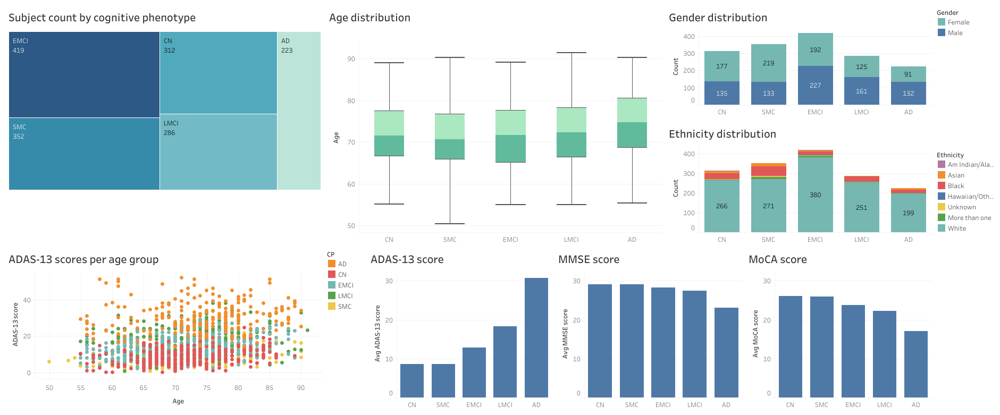

# AD-CogNet

GitHub repository for the code accompanying my MSc in Computational Biology thesis. The project is being carried out at the School of Informatics of the Complutense University of Madrid (UCM). 

## Objectives

The main objective of this project is to construct and analyze a network of cognitive domains in Mild Cognitive Impairment (MCI) and Alzheimer's patients using a graph theory approach to study whether there are some rearrangements of the network due to the progression of dementia. This network will be constructed from raw scores from neuropsychological tests covering several cognitive domains (memory, language, executive function, motor and visuospatial skills, attention, and orientation). Patient's scores will be normalized to those of healthy elderly controls, which are cognitive normal subjects. 

## Technologies

- Python version 3.9.12

- R version 4.2.3

## Files

| File name | Description |
| --- | --- |
| `GT_analysis.ipynb` | Construction and analysis of cognitive networks with the nodes being different cognitive tests |
| `GT_analysis_domains.ipynb` | Construction and analysis of cognitive networks with the nodes being cognitive domains |
| `GT_analysis_genetics.ipynb` | Construction and analysis of cognitive networks for various genetic profiles clusters |
| `results_visualization.R` | Exploratory data analysis and results visualizations |

## Data 

For this work, the demographical and neuropsychological data from the Alzheimer's Disease Neuroimaging Initiative (ADNI) was employed. These datasets are available at the [ADNI website](https://adni.loni.usc.edu/) upon formal request. A complete listing of ADNI investigators can be found in the following [link](http://adni.loni.usc.edu/wp-content/uploads/how_to_apply/ADNI_Acknowledgement_List.pdf).

The original Tableau dashboard can be found in the following [link](https://public.tableau.com/views/AD-CogNet/Dashboard1?:language=es-ES&publish=yes&:display_count=n&:origin=viz_share_link). 

In particular, the ADNI datasets used in the study are the following:

- Neuropsychological Battery [ADNI1,GO,2,3]
- Montreal Cognitive Assessment (MoCA) [ADNIGO,2,3]
- Mini-Mental State Examination (MMSE) [ADNI1,GO,2,3]
- Alzheimer's Disease Assessment Scale (ADAS) [ADNIGO,2,3]ç
- ADNIMERGE - Key ADNI tables merged into one table - Dictionary [ADNI1,GO,2,3]

In addition, we have created some metadata files associating cognitive tests with cognitive tests. These files can be found in the `Data` folder of the current repository. 

## Contributors

Ana Solbas Casajús

MSc in Computational Biology, Technical University of Madrid (UPM)
